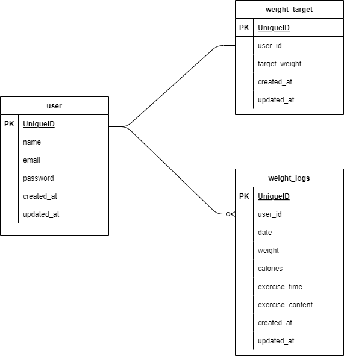

# pigly-laravelのセットアップ手順

## 概要
このプロジェクトは、Laravelを使用したテストプロジェクト「pigly-laravel」です。

## 環境情報
- **OS**: Windows 11  
- **WSL**: WSL2  
- **Docker**: 27.4.0  
- **Docker Compose**: 2.31.0 Desktop.2  
- **PHP**: 7.3 
- **Composer**: 2.8.2  
- **MySQL**: 8.0.26  
- **Laravel Framework**: 8.83.8

## セットアップ手順

### 1. 必要なツールのインストール
以下のツールがインストールされていない場合は、公式サイトからインストールしてください

- [WSL2](https://docs.microsoft.com/en-us/windows/wsl/install)
- [Docker Desktop](https://www.docker.com/products/docker-desktop)
- [Composer](https://getcomposer.org/)

### 2. プロジェクトのクローン
アプリケーションを作成するために、coachtechのカリキュラムで使用したTodoアプリの開発環境を GitHub からクローンします。
laravel-docker-template.gitをクローンしてリポジトリ名をpigly-laravelに変更します

```bash
$ git clone git@github.com:coachtech-material/laravel-docker-template.git 
$ mv laravel-docker-template pigly-laravel
```
GitHub にて個人のリモートリポジトリの url を変更します。
pigly-laravelという変更先のリモートリポジトリをpublicで作成します

変更先のリポジトリの作成が終わったら、ローカルリポジトリから紐付け先を変更します
Set up Desktop or sshを選択し、git@github.com:user name/pigly-laravel.gitをコピーし、作成したリポジトリのurlと記述されている以下の部分にペーストする

```bash
$ cd pigly-laravel
$ git remote set-url origin 作成したリポジトリのurl
$ git remote -v
```
変更先の url が表示されれば成功です
$ origin  git@github.com:username/pigly-laravel.git (fetch)
$ origin  git@github.com:username/pigly-laravel.git (push

次に、現在のローカルリポジトリのデータをリモートリポジトリに反映させます
```bash
$ git add .
$ git commit -m "リモートリポジトリの変更"
$ git push origin main
```
作成したリポジトリに変更が反映されていたら成功です

補足：
この時点では現在の作業ディレクトリにコミットするものがないため、以下のようなメッセージが出る場合がありますが問題ありません

On branch main
Your branch is up to date with 'origin/main'.

nothing to commit, working tree clean

以上のようなメッセージが返ってきた場合には、以下のコマンドを入力し、リモートリポジトリに変更が反映されていたら成功です
```bash
$ git push origin main

```

※エラーが発生する場合は、以下のコマンドを実行しもう一度コマンドを実行してみてください
$ sudo chmod -R 777 *

### 3. Dockerコンテナのセットアップ
プロジェクト内でDockerコンテナを構築します

```bash
$ docker-compose up -d --build
$ code .
```
実行が終わったら、「Docker Desktop」を確認し、pigly-laravelコンテナが作成されていたら成功です

### 4. Composer依存関係のインストール
Laravelの依存関係をインストールするために、コンテナ内でComposerを使用します

まずはPHPコンテナ内にログインします
```bash
$ docker-compose exec php bash
```

ログイン出来たらcomposerコマンドを使って必要なパッケージをインストールします
```bash
$ composer install
```
これで、Laravelプロジェクトの依存関係がインストールされます

### 5. 環境設定
`.env` ファイルを作成（もしまだ作成されていない場合）します。`env.example` ファイルをコピーして `.env` を作成します。

```bash
$ cp .env.example .env
$ exit
```

その後、`.env` ファイルを編集し、MySQLの設定を行います。

```env
DB_CONNECTION=mysql
DB_HOST=mysql← Dockerコンテナ内のサービス名に合わせる
DB_PORT=3306
DB_DATABASE=laravel_db←必要に応じて変更
DB_USERNAME=laravel_user←必要に応じて変更
DB_PASSWORD=laravel_pass←必要に応じて変更
```
※.envファイル作成で保存ができない場合があるので、その時は以下のコマンド実行し、保存してください
$ sudo chmod -R 777 *

### 6. アプリケーションキーの生成
Laravelのアプリケーションキーを生成します。引き続きPHPコンテナ内でコマンド入力

```bash
$ php artisan key:generate
```
コマンドを実行後、.envファイルを開き、APP_KEYと記述された場所に新しいキーが設定されているのを確認します


以上でセットアップは完了になります


### 7. マイグレーションの実行
データベースのマイグレーションを実行します。

```bash
$ docker-compose exec app php artisan migrate
```
これで、必要なテーブルがデータベースに作成されます。

### 8. アクセス確認
セットアップが完了したら、ブラウザで以下のURLにアクセスして、Laravelアプリケーションが正しく動作することを確認します。

```
http://localhost
```
※開発環境によって不要なファイルが含まれています。自己判断で削除してください

## Configuration Files

- [Fortify Settings](Fortify_settings.md)
- [PHP ini Settings](php_ini_settings.md)


こちらのERダイアグラムは、今回の開発環境に基づいたデータベースの構造を示しています。
